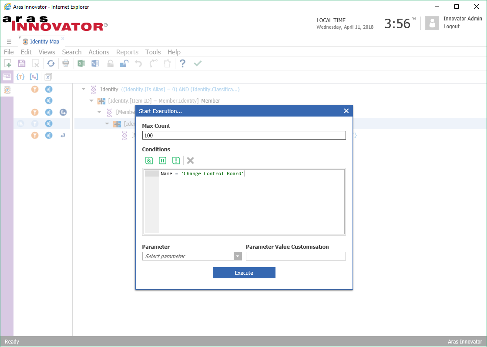

# Identity Map

This project demonstrates how to execute a Query Definition programmatically and visualize the output with D3. A recursive Query Definition retrieves the identity membership data and a form event renders a bubble graph.

## About Query Definitions

### What is a Query Definition?
A Query Definition is a reusable query structure that is defined using the Query Builder GUI. Introduced in Aras 11 SP10, Query Definitions are used for populating certain Aras views, like Tree Grid View. Query definitions can be used to query structures below the context item, structures above the context item, and recursive structures. This project includes a demonstration of a recursive Query Definition (retireves identities that are members of identities).

### What does Query Definition output look like?
When a Query Definition is executed, the results are returned in an XML format that looks a bit like your typical AML data structure, but it has some important differences to consider:

* The Item tag uses an "alias" attribute instead of "type".
* The "alias" attribute may or may not match an ItemType name. The alias can be set explicitly in the Query Builder GUI.
* The Item tag does not include the typical "id", "typeId", or "keyed_name" attributes.
* Item properties contain the id of the referenced item. 
* Related items appear in the "Relationships" tag on the relationship item - not in the "related_item" tag.

### How can I test the XML result of my Query Definition?
The Query Builder includes an action called "Execute Query". This action provides an options dialog where the user can enter a max result, conditions, and parameters:

When the user clicks the "Execute" button, the Query Definition is executed using the options provided by the user and a result dialog provides the XML result of the query.

### How can I see the AML request that is sent to the server?
You can use server debug logs to see the AML request that is created by the Execute Query action. Here are the basic steps for collecting the logs:

1. In the Query Builder view, click **Actions > Execute Query**.
2. Enter your options, but don't click **Execute** just yet.
3. Open up your `InnovatorServerConfig.xml` file in a file editor.
4. Set the `debug_log_flag` operating parameter value to "true".
5. Save the `InnovatorServerConfig.xml` file.
6. In Innovator, click the **Execute** button in the dialog.
7. After the query result appears, go back to the `InnovatorServerConfig.xml` file in your editor.
8. Set the `debug_log_flag` operating parameter value to "false".
    * This is an important step. If you leave server debug logging enabled, you can accumulate a lot of log files in your code tree.
9. Save the `InnovatorServerConfig.xml` file.
10. Navigate to `Innovator\Server\logs\` to find the generated log file with the request AML.
    * Note: You may see several log files generated depending on what else your server is doing while the logging is enabled.
    * You can find the Query Definition-specific log by searching for "qry_QueryDefinition".

## History

Release | Notes
--------|--------
[v1.0.1](https://github.com/ArasLabs/identity-map/releases/tag/v1.0.1) | Added background information about Query Definitions to the README file.
[v1.0.0](https://github.com/ArasLabs/identity-map/releases/tag/v1.0.0) | First release.

#### Supported Aras Versions

Project | Aras
--------|------
[v1.0.1](https://github.com/ArasLabs/identity-map/releases/tag/v1.0.1) | 11.0 SP12, 11.0 SP11
[v1.0.0](https://github.com/ArasLabs/identity-map/releases/tag/v1.0.0) | 11.0 SP12, 11.0 SP11

> Warning: This package is not backwards-compatible with Innovator 11.0 SP10. 

## Installation

#### Important!
**Always back up your code tree and database before applying an import package or code tree patch!**

### Pre-requisites

1. Aras Innovator installed (version 11.0 SP12)
2. Aras Package Import Utility
3. aras.labs.IdentityMap package
4. Code Tree overlay

### Install Steps

#### The Code Tree
1. Backup your code tree and store the backup in a safe place.
2. Copy the `/Innovator/` folder in your local repository.
3. Paste this folder to the root of your code tree.
	* This should be the same folder that contains the `InnovatorServerConfig.xml`.

#### The Database
1. Backup your database and store the BAK file in a safe place.
2. Open up the Aras Package Import tool.
3. Enter your login credentials and click **Login**
    * _Note: You must login as root for the package import to succeed!_
4. Enter the package name in the TargetRelease field.
    * Optional: Enter a description in the Description field.
5. Enter the path to your local `..\identity-map\Import\imports.mf` file in the Manifest File field.
6. Select the following in the Available for Import field.
    * **aras.labs.IdentityMap**
7. Select Type = **Merge** and Mode = **Thorough Mode**.
8. Click **Import** in the top left corner.
9. Close the Aras Package Import tool.

You are now ready to login to Aras and check out the identity map.

## Usage

1. Login to Aras Innovator as admin.
2. Navigate to **Dashboards > Identity Map** in the TOC.

The main grid area will display a bubble chart representing the identity membership in the database. Click on group bubbles to see the labels of the member bubbles.

## Contributing

1. Fork it!
2. Create your feature branch: `git checkout -b my-new-feature`
3. Commit your changes: `git commit -am 'Add some feature'`
4. Push to the branch: `git push origin my-new-feature`
5. Submit a pull request

For more information on contributing to this project, another Aras Labs project, or any Aras Community project, shoot us an email at araslabs@aras.com.

## Credits

Created by Eli Donahue for Aras Labs. @EliJDonahue

Bubble map rendering is based on [Mike Bostock's sample](https://bl.ocks.org/mbostock/7607535).

## License

Aras Labs projects are published to Github under the MIT license. See the [LICENSE file](./LICENSE.md) for license rights and limitations.